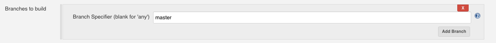
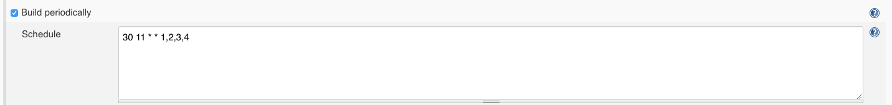
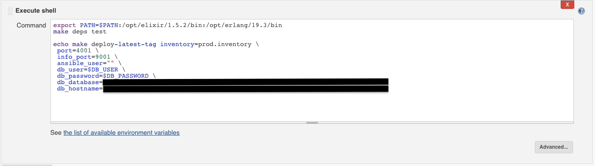

## How Grindr Does:
### Continuous Deployment

---

What is Continuous Deployment?

---

Check out a branch


---

At a recurring time


---

And deploy it to production


note: 
It doesn't matter what build tool this is. It could be done from a cron job just as easily.

---

### Goals

<ol>
  <li class="fragment"> Deploy _to_ anywhere </li>
  <li class="fragment"> Deploy _from_ anywhere </li>
</ol>

---

### Composition


By creating our continuous deployment out of small composable units, we get portability and independence of tasks.

---

### Tasks

1. Tests <!-- .element: class="fragment" -->
2. Deployment Tests <!-- .element: class="fragment" -->
3. Build the artifact <!-- .element: class="fragment" -->
4. Deploy the artifact <!-- .element: class="fragment" -->

note: 
1. Unit Tests / Regression Test / All of your tests
2. We also need to include tests that our deployment works.
3. We need to build the thing being deployed
4. We need to actually deploy it


What is great for running a series of tasks that may or may not be dependent on each other?

---

Makefile Refresher


```makefile
.PHONY cat_hello_world 

hello_world:
    echo "hello world" >> hello_world

cat_hello_world: hello_world 
    cat hello_world
    
say:
    echo $(say)
    
```

note:
1. Dependency tree
2. .PHONY just means that the task is not the name of a file
3. Make will check if the timestamp of your dependencies is older than the timestamp of the current file
4. Glue that holds together shell scripts.

---

### Tasks

1. Tests <!-- .element: class="fragment highlight-blue" -->
2. Deployment Tests
3. Build the artifact
4. Deploy the artifact


---


### Tests

```makefile
test: 
	mix test $$file
``` 
<!-- .element: class="fragment" data-fragment-index="1" -->

```shell
make test [file=test/sometest.exs]
``` 
<!-- .element: class="fragment" data-fragment-index="2" -->

note: 
Some of our large tests require mysql database to be running.

---

```makefile
mysql-test:
	cd docker && $(MAKE) mysql

test: mysql-test
	mix test $$file
```

note:
Whats this $(MAKE) mysql syntax here?
Let's take a look.

---

```makefile
db_user=local_user
db_password=local_password
db_database=grindr
db_hostname=localhost
```

```makefile
mysql: mysql-docker
	@echo -n "Waiting for MYSQL: "
	@i=0; while \
	!(mysql -h 127.0.0.1 -P 33306 -uroot -proot $(db_database) \
	   < ../priv/schema.sql >> error.log 2>&1); do \
	  sleep 1; echo -n '.'; \
	  if [ $$((i+=1)) -gt 60 ] ; then cat error.log ; exit 1; fi;  \
	done
	@echo "DONE"
```

note: 
Looks like mysql is dependent on mysql-docker. 
Lets take a look.

---

```makefile
db_user=local_user
db_password=local_password
db_database=grindr
db_hostname=localhost
```

```makefile
mysql-docker:
	docker ps  | grep profiles_mysql; \
	if [ "$$?" != "0" ];  then \
	docker rm -v $$(docker ps -a | grep profiles_mysql | awk '{print $$1}') ;\
	docker run --rm -d --name profiles_mysql -h profiles_mysql \
	  -p 33306:3306 \
	  -e MYSQL_ROOT_PASSWORD=root \
	  -e MYSQL_USER=$(db_user) \
	  -e MYSQL_PASSWORD=$(db_password) \
	  -e MYSQL_DATABASE=$(db_database) \
	  mysql:latest ; \
	else echo "MYSQL running" ; fi
```

note: 
Alright, so lets run the tests.

So, we have the test _and_ we have a mysql dependency that we can start with `make`.

---


### Tasks

1. ~~Tests~~
2. Deployment Tests <!-- .element: class="fragment highlight-blue" -->
3. Build the artifact
4. Deploy the artifact

---

Now that our application passes tests, we want to deploy.

---

Make automated deployment a prerequisite to production for new projects.

---

Write your tests first, _for everything_. This means write your tests for deployment before you have deployment.

---

Simple. 

Test that we can deploy an instance.


<pre><code class="elixir" data-trim data-noescape>

test "Can deploy an instance" do
  <span class="fragment highlight-blue">start_containers()</span>
  build_target_release("0.1.1")
  deploy_to_containers("0.1.1", ["node-1", "node-2"])
end

</code></pre>

note:
Our first deployment test.
Let's look at start_containers function

note:
We just choose an arbitrary version for this test.

---

```elixir
  defp start_containers() do
    {_, 0} = System.cmd("make",
      ["run-profiles-service-containers"],
      cd: "docker")
  end
```

note: 
Oh, its calling the makefile in docker/

---

<pre><code class="makefile" data-trim data-noescape>
run-profiles-service-containers: \
 <span class="fragment highlight-current-blue" data-fragment-index="0">run-profile-service-container-1</span> \
 <span class="fragment highlight-current-blue" data-fragment-index="0">run-profile-service-container-2</span>
</code></pre>

<pre class="fragment" data-fragment-index="1"><code class="makefile" data-trim data-noescape>
run-profile-service-container-1: \
 <span class="fragment highlight-current-blue" data-fragment-index="3">build-profile-service-image</span> mysql
	-docker rm -f profile_service.1
	docker run -d --name profile_service.1 \
	--link profiles_mysql:mysql-server \
	-p 1022:22 -p 14000:4001 -p 19000:9001 profile-service

run-profile-service-container-2: \
 <span class="fragment highlight-current-blue" data-fragment-index="3">build-profile-service-image</span> mysql
	-docker rm -f profile_service.2
	docker run -d --name profile_service.2 \
	--link profiles_mysql:mysql-server \
	-p 2022:22 -p 24000:4001 -p 29000:9001 profile-service
</code></pre>


<pre class="fragment" data-fragment-index="4"><code class="makefile" data-trim data-noescape>
build-profile-service-image: \
 <span class="fragment highlight-current-blue" data-fragment-index="5">generate-container-keypair</span>
	docker build \
    -t profile-service \
    -f <span class="fragment highlight-current-blue" data-fragment-index="7">profile-service.dockerfile</span> ..
</pre></code>

<pre class="fragment" data-fragment-index="6"><code class="makefile" data-trim data-noescape>
generate-container-keypair:
	rm -rf ../ansible/deployment_test_key*
	ssh-keygen -t rsa \
    -f ../ansible/deployment_test_key -N "" -q
</pre></code>

---

```dockerfile
FROM amazonlinux:2017.03

LABEL maintainer="Chat Team <chat@grindr.com>"
```

---

(Remember I said install anywhere?) 

This will only produce an artifact compatible with amazonlinux:2017.03.

But, because it is composable, we can always add more dockerfiles _when we need to_.

---

```dockerfile
# we need openssh
RUN yum install -y openssh-server
```

---

```dockerfile
RUN sed -i -e 's/UsePAM yes/UsePAM no/g' /etc/ssh/sshd_config

COPY ansible/deployment_test_key.pub /

RUN useradd -m -p "gibberish" -s /bin/bash ec2-user && \
    usermod -aG wheel ec2-user && \
    mkdir /home/ec2-user/.ssh/ && \
    cat /deployment_test_key.pub >> /home/ec2-user/.ssh/authorized_keys &&\
    rm /deployment_test_key.pub && \
    chown -R ec2-user:ec2-user /home/ec2-user && \
    chmod 700 /home/ec2-user/.ssh && \
    chmod 600 /home/ec2-user/.ssh/authorized_keys && \
    echo "ec2-user ALL=(ALL) NOPASSWD:ALL" >> /etc/sudoers
```

---

```dockerfile
# SSH
EXPOSE 22
# WebSockets
EXPOSE 4000
# Info
EXPOSE 9000

CMD /etc/init.d/sshd start && tail /dev/null -f
```

---

<pre><code class="makefile" data-trim data-noescape>
run-profiles-service-containers: \
 run-profile-service-container-1 \
 run-profile-service-container-2

run-profile-service-container-1: \
 build-profile-service-image mysql
	-docker rm -f profile_service.1
	docker run -d --name profile_service.1 \
	--link profiles_mysql:mysql-server \
	-p 1022:22 -p 14000:4001 -p 19000:9001 profile-service

run-profile-service-container-2: \
 build-profile-service-image mysql
	-docker rm -f profile_service.2
	docker run -d --name profile_service.2 \
	--link profiles_mysql:mysql-server \
	-p 2022:22 -p 24000:4001 -p 29000:9001 profile-service
</code></pre>

note:
So, now we have the containers running and they have ssh on them.
Can you guess what comes next?

---

<pre><code class="elixir" data-trim data-noescape>
test "Can deploy an instance" do
  start_containers()
  <span class="fragment highlight-blue">build_target_release("0.1.1")</span>
  deploy_to_containers("0.1.1", ["node-1", "node-2"])
end
</code></pre>

---

<pre><code class="elixir" data-trim data-noescape>
defp build_target_release(commit_ref) do
  {_, 0} = System.cmd("make",
    ["profile_service.tar.gz", "commit_ref=#{commit_ref}"], cd: "docker")
end
</code></pre>

---

<pre><code class="makefile" data-trim data-noescape>
profile_service.tar.gz: target-release
	rm -f profile_service.tar.gz
	mv _deploy/profile_service.tar.gz .
</code></pre>

<pre class="fragment" data-fragment-index="2"><code class="makefile" data-trim data-noescape>
target-release: check-vars docker-build
	-docker rm -f amazonlinux-build-box
	docker run --name amazonlinux-build-box \
		-v $$(pwd)/_deploy:/root/_deploy \
		amazonlinux-erl-iex:19.3-14.4.4
</code></pre>

<pre class="fragment" data-fragment-index="4"><code class="makefile" data-trim data-noescape>
check-vars:
ifndef commit_ref
	$(error commit_ref is undefined)
endif
</code></pre>

<pre class="fragment" data-fragment-index="6"><code class="makefile" data-trim data-noescape>
docker-build: checkout-version
	docker build -t amazonlinux-erl-iex:19.3-14.4.4 \
    -f Dockerfile .
</code></pre>

---

```makefile
_deploy:
	rm -rf _deploy && mkdir _deploy

_deploy/profile-service: _deploy
	# We want to be able to test commits that haven't been pushed.
	# So, we check out the local git repo from disk
	repo_dir=$$(cd .. && pwd); \
	git clone --local $$repo_dir _deploy/profile-service

checkout-version: _deploy/profile-service
	cd _deploy/profile-service && \
	git fetch && \
	git checkout $(commit_ref) && \
	make deps
```

note: 
We are cloning the repo into _deploy directory

---

<pre><code class="makefile" data-trim data-noescape>
profile_service.tar.gz: target-release
	rm -f profile_service.tar.gz
	mv _deploy/profile_service.tar.gz .
</code></pre>

<pre><code class="makefile" data-trim data-noescape>
target-release: check-vars docker-build
	-docker rm -f amazonlinux-build-box
	docker run --name amazonlinux-build-box \
		-v $$(pwd)/_deploy:/root/_deploy \
		amazonlinux-erl-iex:19.3-14.4.4
</code></pre>

<pre><code class="makefile" data-trim data-noescape>
check-vars:
ifndef commit_ref
	$(error commit_ref is undefined)
endif
</code></pre>

<pre><code class="makefile" data-trim data-noescape>
docker-build: checkout-version
	docker build -t amazonlinux-erl-iex:19.3-14.4.4 \
    -f <span class="fragment highlight-current-blue">Dockerfile</span> .
</code></pre>

---

```dockerfile
FROM amazonlinux:2017.03

LABEL maintainer="Chat Team <chat@grindr.com>"

WORKDIR /root

RUN yum install -y sed which openssl unzip wget
```

---

```dockerfile
RUN wget http://packages.erlang-solutions.com/site/esl/esl-erlang/FLAVOUR_1_general/esl-erlang_19.3.6-1~centos~7_amd64.rpm
RUN rpm -i --nodeps esl-erlang_19.3.6-1~centos~7_amd64.rpm

RUN wget https://github.com/elixir-lang/elixir/releases/download/v1.4.4/Precompiled.zip && \
    mkdir -p /opt/elixir/1.4.4/ && \
    unzip Precompiled -d /opt/elixir/1.4.4/
```

note:
We need to actually have erlang / elixir running on these docker images, vs those where we just run the build.

---

```dockerfile
VOLUME /root/_deploy
```

---

```dockerfile

RUN yum install -y git
 
ENV PATH="/opt/elixir/1.4.4/bin:${PATH}"
ENV LC_ALL="en_US.UTF-8"

CMD cd /root/_deploy/profile-service && rm -rf _build && \
    make setup && make rel && \
  cp _build/prod/rel/profile_service/releases/`git describe --always --tags`/profile_service.tar.gz ../ && \
  cd /root && chmod -R a+rw *
```

note:
Why are we doing that weird thing with git?

---

```elixir
def project do
  [
    app: :profile_service,
    version: current_git_version(),
    elixir: "~> 1.4",
    elixirc_paths: elixirc_paths(Mix.env),
    compilers: [:phoenix, :gettext] ++ Mix.compilers,
    start_permanent: Mix.env == :prod,
    aliases: aliases(),
    deps: deps()
  ]
end
```

```elixir
defp current_git_version do
  {rev, 0} = System.cmd("git", ["describe", "--always", "--tags"])
  String.trim(rev)
end
```

---

```shell
> git describe --always --tags
0.1.1-39-g2864ed4
```

---

<pre><code class="makefile" data-trim data-noescape>
profile_service.tar.gz: target-release
	rm -f profile_service.tar.gz
	mv _deploy/profile_service.tar.gz .
</code></pre>

<pre><code class="makefile" data-trim data-noescape>
target-release: check-vars docker-build
	-docker rm -f amazonlinux-build-box
	docker run --name amazonlinux-build-box \
		-v $$(pwd)/_deploy:/root/_deploy \
		amazonlinux-erl-iex:19.3-14.4.4
</code></pre>

<pre><code class="makefile" data-trim data-noescape>
check-vars:
ifndef commit_ref
	$(error commit_ref is undefined)
endif
</code></pre>

<pre><code class="makefile" data-trim data-noescape>
docker-build: checkout-version
	docker build -t amazonlinux-erl-iex:19.3-14.4.4 \
    -f Dockerfile .
</code></pre>

---

<pre><code class="elixir" data-trim data-noescape>
test "Can deploy an instance" do
  start_containers()
  build_target_release("0.1.1")
  <span class="fragment highlight-blue">deploy_to_containers("0.1.1", ["node-1", "node-2"])</span>
end
</code></pre>

---

<pre><code class="elixir" data-trim data-noescape>
defp deploy_to_containers(commit_ref, nodes) do
  {_, 0} = System.cmd("make",
    ["deploy", "inventory=test.inventory", "db_hostname=mysql-server",
     "commit_ref=#{commit_ref}"], cd: "ansible")
end
</code></pre>

note:
What is wrong here?
We aren't using `nodes`. There is actually a TODO in the real code.

---

```makefile
port=4001
info_port=9001
ansible_user=""
db_user=local_user
db_password=local_password
db_database=grindr
db_hostname=localhost
```

---

```makefile
deploy: check-vars
	ansible-playbook ./playbooks/full_deploy.yml \
	  -i $(inventory) \
	  -e INFO_PORT=$(info_port) \
	  -e PORT=$(port) \
	  -e DB_USER=$(db_user)  \
	  -e DB_PASSWORD=$(db_password) \
	  -e DB_HOSTNAME=$(db_hostname) \
	  -e DB_DATABASE=$(db_database)
```

```makefile
check-vars:
ifndef inventory
	$(error inventory is undefined)
endif
ifndef commit_ref
	$(error commit_ref is undefined)
endif
```

---

What is ansible?

<div class="fragment">
It doesn't really matter what it is. 

It is just a set of tools that help you set up a machine and upload an artifact.

You could simply use `scp`, `ssh` and `bash`. 
</div>

---

Ansible Inventory

<pre class="fragment"><code class="yml">
[node-1]
profile_service.1.local ansible_port=1022

[node-2]
profile_service.2.local ansible_port=2022

[nodes:children]
node-1
node-2

[nodes:vars]
ansible_host=127.0.0.1
ansible_user=ec2-user
ansible_ssh_private_key_file=deployment_test_key
</code></pre>

---

<pre><code class="makefile" data-trim data-noescape>
run-profile-service-container-1: build-profile-service-image mysql
	-docker rm -f profile_service.1
	docker run -d --name <span class="fragment highlight-blue" data-fragment-index="1">profile_service.1</span> \
	--link profiles_mysql:mysql-server \
	<span class="fragment highlight-blue" data-fragment-index="1">-p 1022:22 -p 14000:4001 -p 19000:9001 profile-service</span>

run-profile-service-container-2: build-profile-service-image mysql
	-docker rm -f profile_service.2
	docker run -d --name <span class="fragment highlight-blue" data-fragment-index="1">profile_service.2</span> \
	--link profiles_mysql:mysql-server \
	<span class="fragment highlight-blue" data-fragment-index="1">-p 2022:22 -p 24000:4001 -p 29000:9001 profile-service</span>
    </code></pre>

<pre><code class="makefile" data-trim data-noescape>
generate-container-keypair:
	rm -rf ../ansible/deployment_test_key*
	ssh-keygen -t rsa -f <span class="fragment highlight-blue" data-fragment-index="2">../ansible/deployment_test_key -N "" -q</span>
</code></pre>

note:

Remember this? Ah, yeah, now it make sense?

---

```shell
ansible-playbook -i inventory_file -e ENV_VAR_1 -e ENV_VAR_2
```

---

`full_deploy.yml`
```yml
- include: pre_deploy.yml
- include: deploy.yml
- include: post_deploy.yml
```

---

`deploy.yml`
<pre><code class="yaml" data-trim data-noescape>
- name: Upload the build
  unarchive:
    src: ../../docker/profile_service.tar.gz
    dest: /home/profile_service/profile_service
</code></pre>

<pre class="fragment"><code class="yaml" data-trim data-noescape>
- name: Run the service
  shell: source env.sh && nohup bin/profile_service foreground &
  args:
    executable: /bin/bash
    chdir: /home/profile_service/profile_service
</code></pre>

<pre class="fragment"><code class="yaml" data-trim data-noescape>
- name: Check if can query
  uri:
    url: http://127.0.0.1:{{PORT}}/profiles?ids=
</code></pre>

note: 
A playbook is just a yaml file with instructions.
It has tasks such as ...

---

<pre class="fragment"><code class="elixir" data-trim data-noescape>
test "Can deploy an instance" do
  start_containers()
  build_target_release("0.1.1")
  deploy_to_containers("0.1.1", ["node-1", "node-2"])
end
</code></pre>

---


Upgrade Test

<pre class="fragment"><code class="elixir" data-trim data-noescape>
test "Can upgrade from last tag to latest git ref" do
  start_containers()
  old_version = hd(versions())
  next_version = current_ref()
  build_target_release(old_version)
  deploy_to_containers(old_version, ["node-1", "node-2"])

  build_target_release(next_version)
  deploy_to_containers(next_version, ["node-1", "node-2"])
end
</code></pre>


<pre class="fragment"><code class="elixir" data-trim data-noescape>
defp current_ref do
  {r, 0} = System.cmd("git", ["rev-parse", "HEAD"])
  String.trim(r)
end

defp versions do
  {versions, 0} = System.cmd("git", ["tag", "--sort=-v:refname"])
  String.split(versions)
end
</code></pre>


note:
It turns out we already can do everything. 


---


### Tasks

1. ~~Tests~~
2. ~~Deployment Tests~~
3. ~~Build the artifact~~ <!-- .element class="fragment" -->
4. ~~Deploy the artifact~~ <!-- .element class="fragment" -->


note:
We already solved for building the artifact.
And we already solved for deploying the artifact.

Isn't TDD nice?


---


We are done.

We have continuous delivery composed of tasks.

`make` can be run anywhere, from your laptop, a cron job, jenkins, and the next new thing

As a result, we can deploy _from_ anywhere, _to_ anywhere.


```
Finished: SUCCESS
```

---


How did we do it?

We just composed it of the various tasks we need.

We build continuous deployment by _not_ building continuous deployment.

---

Don't be intimidated!

There is a lot here, but we figured it all out just by building what we needed piece by piece. 

You, too, can build your own continuous delivery pipeline, 
and some may be borrowed from what you saw today, and other parts will be different to suit your needs.

Don't wait for someone else to build it or it will never happen. Nobody else can build what _you_ need.

