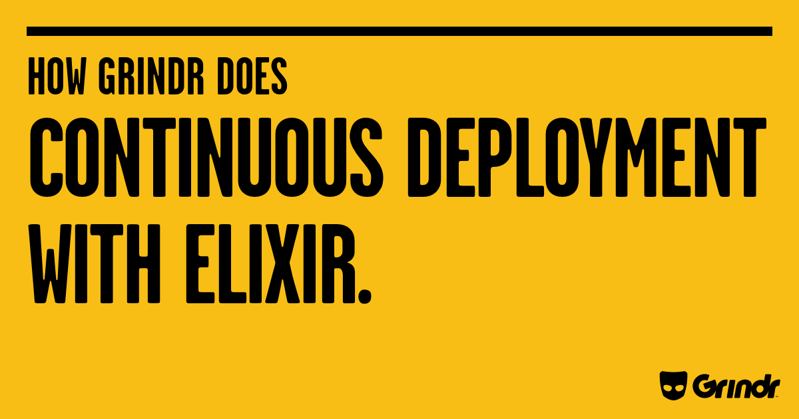

---

What is Continuous Deployment?

---

Check out a branch


---

At a recurring time


---

And deploy it to production


note: 
It doesn't matter what build tool this is. It could be done just be a cron job.

---

### Why

1. Keeps the deployment process working continuously without surprises.
2. Deploy often with less overhead.
3. Keeps deployments small. 

note:
There are a lot of reasons, but I will focus on just a few. 

---

Why does engineering stop after code is written? 

Getting code to production is part of the job, and continuous deployment _just is_ the automation of deployment.


---

### Composition


By creating our continuous deployment out of small composable units, we get portability and independence of tasks.


---


### Goals

<ol>
  <li class="fragment"> Deploy _to_ anywhere </li>
  <li class="fragment"> Deploy _from_ anywhere </li>
</ol>

note:
We decided if we could deploy to anywhere and from anywhere, then everything else would fall into place. 


---

### Tasks

1. Tests <!-- .element: class="fragment" -->
2. Deployment Tests <!-- .element: class="fragment" -->
3. Build the artifact <!-- .element: class="fragment" -->
4. Deploy the artifact <!-- .element: class="fragment" -->

note: 
1. We practice test driven development. We have unit tests integration tests.
2. We also need to include tests that our deployment works.
3. We need to build the thing being deployed
4. We need to actually deploy it


---


What is great for running a series of tasks that may or may not be dependent on each other?

note:
1. Anybody have any ideas?
2. Show of hands - Who has written a Makefile?
3. Who uses make on a daily basis?


---


Makefile Refresher


```makefile
.PHONY cat_hello_world 

target: source
    command

hello_world:
    echo "hello world" >> hello_world

cat_hello_world: hello_world 
    cat hello_world
    
say:
    echo $(say)
    
```

note:
4. Glue that holds together shell scripts.
1. Dependency tree
2. .PHONY just means that the task is not the name of a file
3. Make will check if the timestamp of your dependencies is older than the timestamp of the current file

---


```makefile
db_user=local_user
db_password=local_password
db_database=grindr
db_hostname=localhost
```

note:
You can give default values to variables in the makefile as well.

---

### Tasks

1. Tests <!-- .element: class="fragment highlight-blue" -->
2. Deployment Tests
3. Build the artifact
4. Deploy the artifact


---

### Tests

As an engineer, tests should be a prerequisite to almost everything you do.
A test is a prerequisite to writing code.

---

```makefile
test: 
	mix test $$file
``` 

```shell
make test [file=test/sometest.exs]
``` 
<!-- .element: class="fragment" data-fragment-index="2" -->

note: 
But what if our tests reguire MySQL to be running. We have integration tests that do test the data layer.

---

```makefile
mysql-test:
	cd docker && $(MAKE) mysql

test: mysql-test
	mix test $$file
```

note:
1. This $(MAKE) just runs make.
2. Lets look at the Makefile in the docker directory.

---


```makefile
mysql: mysql-docker
	@echo -n "Waiting for MYSQL: "
	@i=0; while \
	!(mysql -h 127.0.0.1 -P 33306 -uroot -proot $(db_database) \
	   < ../priv/schema.sql >> error.log 2>&1); do \
	  sleep 1; echo -n '.'; \
	  if [ $$((i+=1)) -gt 60 ] ; then cat error.log ; exit 1; fi;  \
	done
	@echo "DONE"
```

note: 
Looks like mysql is dependent on mysql-docker. 
Lets take a look.

---

```makefile
mysql-docker:
	docker ps  | grep profiles_mysql; \
	if [ "$$?" != "0" ];  then \
	docker rm -v $$(docker ps -a | grep profiles_mysql | awk '{print $$1}') ;\
	docker run --rm -d --name profiles_mysql -h profiles_mysql \
	  -p 33306:3306 \
	  -e MYSQL_ROOT_PASSWORD=root \
	  -e MYSQL_USER=$(db_user) \
	  -e MYSQL_PASSWORD=$(db_password) \
	  -e MYSQL_DATABASE=$(db_database) \
	  mysql:latest ; \
	else echo "MYSQL running" ; fi
```

note: 
So, we have the test _and_ we have a mysql dependency that we can start with `make`.


---


### Tasks

1. ~~Tests~~
2. Deployment Tests <!-- .element: class="fragment highlight-blue" -->
3. Build the artifact
4. Deploy the artifact

---

Now that our application passes tests, we want to deploy.

---


1. Require automated deployment as a prerequisite to production for new projects.
2. Write your tests first, _for everything_. This means write your tests for deployment before you have deployment.

---


Simple. 

Test that we can deploy an instance.


<pre><code class="elixir" data-trim data-noescape>

test "Can deploy an instance" do
  <span class="fragment highlight-blue">start_containers()</span>
  build_target_release("0.1.1")
  deploy_to_containers("0.1.1", ["node-1", "node-2"])
end

</code></pre>

note:
Here is our first deployment test. Note that the version is arbitrary here.
Let's look at the start_containers function.

---

```elixir
  defp start_containers() do
    {_, 0} = System.cmd("make",
      ["run-profiles-service-containers"],
      cd: "docker")
  end
```

note: 
This test is calling the Makefile in the docker directory and asserting that it returns successfully.

---

<pre><code class="makefile" data-trim data-noescape>
run-profiles-service-containers: \
 <span class="fragment highlight-current-blue" data-fragment-index="0">run-profile-service-container-1</span> \
 <span class="fragment highlight-current-blue" data-fragment-index="0">run-profile-service-container-2</span>
</code></pre>

<pre class="fragment" data-fragment-index="1"><code class="makefile" data-trim data-noescape>
run-profile-service-container-1: \
 <span class="fragment highlight-current-blue" data-fragment-index="2">build-profile-service-image</span> mysql
	-docker rm -f profile_service.1
	docker run -d --name profile_service.1 \
	--link profiles_mysql:mysql-server \
	-p 1022:22 -p 14000:4001 -p 19000:9001 profile-service

run-profile-service-container-2: \
 <span class="fragment highlight-current-blue" data-fragment-index="2">build-profile-service-image</span> mysql
	-docker rm -f profile_service.2
	docker run -d --name profile_service.2 \
	--link profiles_mysql:mysql-server \
	-p 2022:22 -p 24000:4001 -p 29000:9001 profile-service
</code></pre>


---

<pre><code class="makefile" data-trim data-noescape>
build-profile-service-image: \
 <span class="fragment highlight-current-blue">generate-container-keypair</span>
	docker build \
    -t profile-service \
    -f <span class="fragment highlight-current-blue">profile-service.dockerfile</span> ..
</pre></code>


<pre><code class="makefile" data-trim data-noescape>
generate-container-keypair:
	rm -rf ../ansible/deployment_test_key*
	ssh-keygen -t rsa \
    -f ../ansible/deployment_test_key -N "" -q
</pre></code>

---

```dockerfile
FROM amazonlinux:2017.03

LABEL maintainer="Chat Team <chat@grindr.com>"
```

note:
We use amazonlinux in our preproduction and production environment.

---

(Remember I said deploy anywhere?) 

This will only produce an artifact compatible with amazonlinux:2017.03.

But, because it is composable, we can always add more dockerfiles _when we need to_.

---

```dockerfile
# we need openssh
RUN yum install -y openssh-server
```

---

```dockerfile
RUN sed -i -e 's/UsePAM yes/UsePAM no/g' /etc/ssh/sshd_config

COPY ansible/deployment_test_key.pub /

RUN useradd -m -p "gibberish" -s /bin/bash ec2-user && \
    usermod -aG wheel ec2-user && \
    mkdir /home/ec2-user/.ssh/ && \
    cat /deployment_test_key.pub >> /home/ec2-user/.ssh/authorized_keys &&\
    rm /deployment_test_key.pub && \
    chown -R ec2-user:ec2-user /home/ec2-user && \
    chmod 700 /home/ec2-user/.ssh && \
    chmod 600 /home/ec2-user/.ssh/authorized_keys && \
    echo "ec2-user ALL=(ALL) NOPASSWD:ALL" >> /etc/sudoers
```

---

```dockerfile
# SSH
EXPOSE 22
# WebSockets
EXPOSE 4000
# Info
EXPOSE 9000

CMD /etc/init.d/sshd start && tail /dev/null -f
```

---

```makefile
run-profile-service-container-2: \
 build-profile-service-image mysql
	-docker rm -f profile_service.2
	docker run -d --name profile_service.2 \
	--link profiles_mysql:mysql-server \
	-p 2022:22 -p 24000:4001 -p 29000:9001 profile-service
```

note:
Lets look back on one of these tasks. 
We are running the container so that we can ssh into it to deploy an artifact.


---


<pre><code class="elixir" data-trim data-noescape>
test "Can deploy an instance" do
  start_containers()
  <span class="fragment highlight-blue">build_target_release("0.1.1")</span>
  deploy_to_containers("0.1.1", ["node-1", "node-2"])
end
</code></pre>


---

<pre><code class="elixir" data-trim data-noescape>
defp build_target_release(commit_ref) do
  {_, 0} = System.cmd("make",
    ["profile_service.tar.gz", "commit_ref=#{commit_ref}"], cd: "docker")
end
</code></pre>

---

<pre><code class="makefile" data-trim data-noescape>
profile_service.tar.gz: target-release
	rm -f profile_service.tar.gz
	mv _deploy/profile_service.tar.gz .
</code></pre>

<pre class="fragment" data-fragment-index="2"><code class="makefile" data-trim data-noescape>
target-release: check-vars docker-build
	-docker rm -f amazonlinux-build-box
	docker run --name amazonlinux-build-box \
		-v $$(pwd)/_deploy:/root/_deploy \
		amazonlinux-erl-iex:19.3-14.4.4
</code></pre>

note:
1. We want to generate the artifact, which depends on target-release.
2. target-release builds the release in a docker container. You will see the build in the dockerfile itself.
3. It is dependent on check-vars and docker-build

---


<pre><code class="makefile" data-trim data-noescape>
check-vars:
ifndef commit_ref
	$(error commit_ref is undefined)
endif
</code></pre>

<pre class="fragment" data-fragment-index="6"><code class="makefile" data-trim data-noescape>
docker-build: checkout-version
	docker build -t amazonlinux-erl-iex:19.3-14.4.4 \
    -f Dockerfile .
</code></pre>

note:
1. Check vars just throws an error if commit_ref is undefined.
2. docker-build builds the docker image (but does not run it)

---

```makefile
_deploy:
	rm -rf _deploy && mkdir _deploy

_deploy/profile-service: _deploy
	# We want to be able to test commits that haven't been pushed.
	# So, we check out the local git repo from disk
	repo_dir=$$(cd .. && pwd); \
	git clone --local $$repo_dir _deploy/profile-service

checkout-version: _deploy/profile-service
	cd _deploy/profile-service && \
	git fetch && \
	git checkout $(commit_ref) && \
	make deps

```

note: 
1. Here we are actually cloning our current, local git repository into a directory that is accessible to docker, so that the docker image can build it. 
2. We call make deps first so that we can pull dependencies that are in a private git repo.


---

```dockerfile
FROM amazonlinux:2017.03

LABEL maintainer="Chat Team <chat@grindr.com>"

WORKDIR /root

RUN yum install -y sed which openssl unzip wget git
```

note:
Again, we use amazonlinux and we install some dependencies we will need.

---

```dockerfile
RUN wget http://packages.erlang-solutions.com/site/esl/esl-erlang/FLAVOUR_1_general/esl-erlang_19.3.6-1~centos~7_amd64.rpm
RUN rpm -i --nodeps esl-erlang_19.3.6-1~centos~7_amd64.rpm

RUN wget https://github.com/elixir-lang/elixir/releases/download/v1.4.4/Precompiled.zip && \
    mkdir -p /opt/elixir/1.4.4/ && \
    unzip Precompiled -d /opt/elixir/1.4.4/
```

note:
We need to actually have erlang / elixir running on these docker images, so we need to install these.

---

```dockerfile
VOLUME /root/_deploy
```

note:
We mount the directory that the cloned repository is in.


---

```dockerfile

ENV PATH="/opt/elixir/1.4.4/bin:${PATH}"
ENV LC_ALL="en_US.UTF-8"

CMD cd /root/_deploy/profile-service && rm -rf _build && \
    make setup && make rel && \
  cp _build/prod/rel/profile_service/releases/\
  `git describe --always --tags`/profile_service.tar.gz ../ && \
  cd /root && chmod -R a+rw *
```


note:
1. This is the part that runs when we do `docker run`.
2. Notice this git command here.

---

```elixir
def project do
  [
    app: :profile_service,
    version: current_git_version(),
    elixir: "~> 1.4",
    elixirc_paths: elixirc_paths(Mix.env),
    compilers: [:phoenix, :gettext] ++ Mix.compilers,
    start_permanent: Mix.env == :prod,
    aliases: aliases(),
    deps: deps()
  ]
end
```

```elixir
defp current_git_version do
  {rev, 0} = System.cmd("git", ["describe", "--always", "--tags"])
  String.trim(rev)
end
```

---

```shell
> git describe --always --tags
0.1.1-39-g2864ed4
```

note:
This is how we version the project. Automated versions.

---

<pre><code class="makefile" data-trim data-noescape>
target-release: check-vars docker-build
	-docker rm -f amazonlinux-build-box
	docker run --name amazonlinux-build-box \
		-v $$(pwd)/_deploy:/root/_deploy \
		amazonlinux-erl-iex:19.3-14.4.4
</code></pre>

note:
Lets take a quick look back at target-release. This is where we run the docker image which builds the artifact.

---

<pre><code class="elixir" data-trim data-noescape>
test "Can deploy an instance" do
  start_containers()
  build_target_release("0.1.1")
  <span class="fragment highlight-blue">deploy_to_containers("0.1.1", ["node-1", "node-2"])</span>
end
</code></pre>

---

<pre><code class="elixir" data-trim data-noescape>
defp deploy_to_containers(commit_ref, nodes) do
  {_, 0} = System.cmd("make",
    ["deploy", "inventory=test.inventory", "db_hostname=mysql-server",
     "commit_ref=#{commit_ref}"], cd: "ansible")
end
</code></pre>

note:
This time we use a make deploy task in our ansible directory, and pass it two arguments.
1. The test inventory.
2. The database hostname.

---

```makefile
port=4001
info_port=9001
ansible_user=""
db_user=local_user
db_password=local_password
db_database=grindr
db_hostname=localhost
```

---

```makefile
deploy: check-vars
	ansible-playbook ./playbooks/full_deploy.yml \
	  -i $(inventory) \
	  -e INFO_PORT=$(info_port) \
	  -e PORT=$(port) \
	  -e DB_USER=$(db_user)  \
	  -e DB_PASSWORD=$(db_password) \
	  -e DB_HOSTNAME=$(db_hostname) \
	  -e DB_DATABASE=$(db_database)
```

```makefile
check-vars:
ifndef inventory
	$(error inventory is undefined)
endif
ifndef commit_ref
	$(error commit_ref is undefined)
endif
```

note:
1. Show of hands - Who has used ansible?
2. Who uses ansible on a daily basis?

---

What is ansible?

<div class="fragment">
It doesn't really matter what it is. 

It is a set of tools that help you set up a machine and upload an artifact. Some people like using it.

You could simply use `scp`, `ssh` and `bash`. 
</div>


---

Ansible Inventory

<pre class="fragment"><code class="yml">
[node-1]
profile_service.1.local ansible_port=1022

[node-2]
profile_service.2.local ansible_port=2022

[nodes:children]
node-1
node-2

[nodes:vars]
ansible_host=127.0.0.1
ansible_user=ec2-user
ansible_ssh_private_key_file=deployment_test_key
</code></pre>

note:
Remember that key we generated? Here is where it comes into play. This is the key that ansible will use to SSH into those instances.

---

```shell
ansible-playbook some-playbook.yml -i inventory_file -e ENV_VAR_1 -e ENV_VAR_2 
```

---

`full_deploy.yml`
```yml
- include: pre_deploy.yml
- include: deploy.yml
- include: post_deploy.yml
```

---

`deploy.yml`
<pre><code class="yaml" data-trim data-noescape>
- name: Upload the build
  unarchive:
    src: ../../docker/profile_service.tar.gz
    dest: /home/profile_service/profile_service
</code></pre>

<pre class="fragment"><code class="yaml" data-trim data-noescape>
- name: Run the service
  shell: source env.sh && nohup bin/profile_service foreground &
  args:
    executable: /bin/bash
    chdir: /home/profile_service/profile_service
</code></pre>

<pre class="fragment"><code class="yaml" data-trim data-noescape>
- name: Check if can query
  uri:
    url: http://127.0.0.1:{{PORT}}/profiles?ids=
</code></pre>

note: 
A playbook is just a yaml file with instructions.
Here are some of the tasks.

---

<pre><code class="elixir" data-trim data-noescape>
test "Can deploy an instance" do
  start_containers()
  build_target_release("0.1.1")
  deploy_to_containers("0.1.1", ["node-1", "node-2"])
end
</code></pre>

note:
We are done with this test. Lets test that our current version is actually deployable.


---


Upgrade Test

<pre class="fragment"><code class="elixir" data-trim data-noescape>
test "Can upgrade from last tag to latest git ref" do
  start_containers()
  old_version = hd(versions())
  next_version = current_ref()
  build_target_release(old_version)
  deploy_to_containers(old_version, ["node-1", "node-2"])

  build_target_release(next_version)
  deploy_to_containers(next_version, ["node-1", "node-2"])
end
</code></pre>


<pre class="fragment"><code class="elixir" data-trim data-noescape>
defp current_ref do
  {r, 0} = System.cmd("git", ["rev-parse", "HEAD"])
  String.trim(r)
end

defp versions do
  {versions, 0} = System.cmd("git", ["tag", "--sort=-v:refname"])
  String.split(versions)
end
</code></pre>


note:
It turns out we already can do everything. Take a look and let me know if you have questions.


---


### Tasks

1. ~~Tests~~
2. ~~Deployment Tests~~
3. ~~Build the artifact~~ <!-- .element class="fragment" -->
4. ~~Deploy the artifact~~ <!-- .element class="fragment" -->


note:
We already solved for building the artifact.
And we already solved for deploying the artifact.

Isn't TDD nice?


---


We are done.

We have continuous delivery composed of tasks.

`make` can be run anywhere, from your laptop, a cron job, jenkins, and the next new thing.

As a result, we can deploy _from_ anywhere, _to_ anywhere.


```
Finished: SUCCESS
```

---


How did we do it?

We just composed it of the various tasks we need.

We build continuous deployment by _not_ building continuous deployment.

---

Don't be intimidated!

There is a lot here, but we figured it all out just by building what we needed piece by piece. 

You, too, can build your own continuous delivery pipeline, 
and some may be borrowed from what you saw today, and other parts will be different to suit your needs.

Don't wait for someone else to build it or it will never happen. Nobody else can build what _you_ need.

---

Thanks to the great engineers that contributed.

Nicolas Mosconi
Robert Tibljas
Valentin Traverso
Justin Standard
Rafal Studnicki
Simon Zelazny


